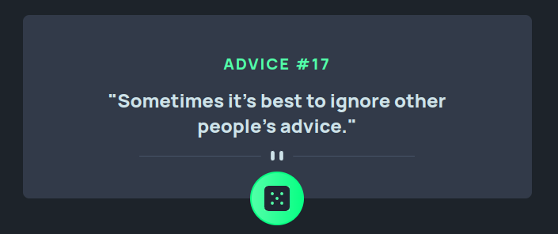
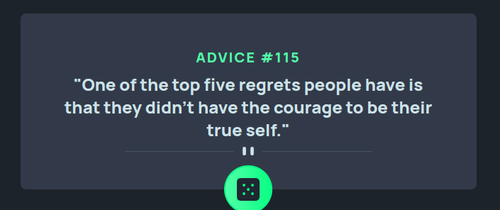
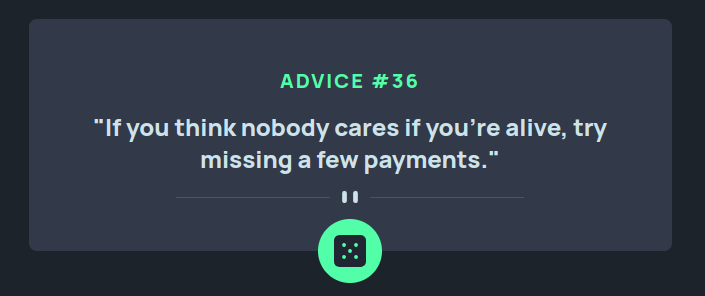
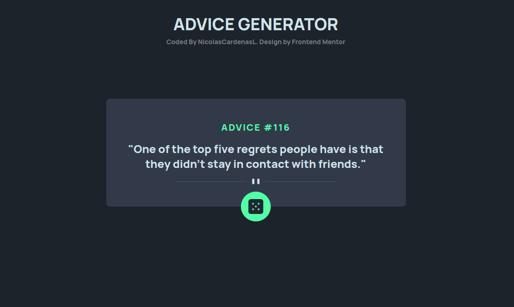
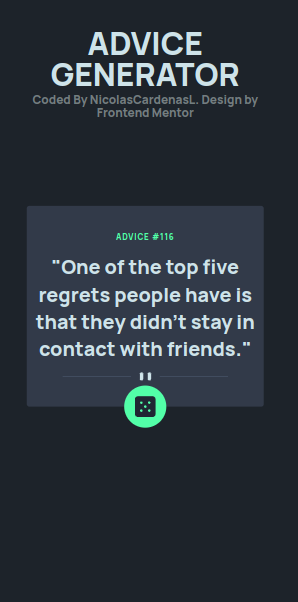

# Random advice generator: solution

This is a solution to the [Advice generator app challenge on Frontend Mentor](https://www.frontendmentor.io/challenges/advice-generator-app-QdUG-13db). Frontend Mentor challenges help you improve your coding skills by building realistic projects.

## Table of contents
- [Getting started](#getting-started)
  - [Prerequisites](#prerequisites)
  - [Installation](#installation)
- [Overview](#overview)
  - [The challenge](#the-challenge)
  - [Screenshot](#screenshot)
- [My process](#my-process)
  - [Built with](#built-with)
  - [After making this project ](#after-making-this-project )
  - [Useful resources](#useful-resources)
- [Author](#author)

## Getting Started

### Prerequisites
This web site was built using ReactJs. You shall install Node and npm in order to use it:
* [How to install Node.js on Windows, Linux or MacOs](https://kinsta.com/blog/how-to-install-node-js/)

### Installation

1. Clone the repo
   ```sh
   git clone https://github.com/NicolasCardenasL/random-advice-generator-web-app.git
   ```
2. Install NPM packages
   ```sh
   npm install
   ```
3. Run a localhost server
   ```sh
   npm run dev
   ```

## Usage

Even though the idea of this project (and its design) isn't mine I found this idea very useful to spread joy. This web site was built in order to, not just to give random advices, but to entertain and get someone's smile. Subsequently, the next images are proof of this.
<section align="center">
  
  
  
</section>

## Overview

### The challenge

Users should be able to:

- View the optimal layout for the app depending on their device's screen size
- See hover states for all interactive elements on the page
- Generate a new piece of advice by clicking the dice icon

### Screenshots
#### Desktop view
<section align="center">
  
</section>

#### Mobile view
<section align="center">
  
</section>

## My Process

### Built with

- Semantic HTML5 markup
- Typescript
- npm and Nodejs
- Mobile-first workflow
- [Advice slip json API](https://api.adviceslip.com/) -  For random advices
- [React](https://reactjs.org/) - for states and components 
- [Tailwindcss](https://tailwindcss.com/) - For styles

### After making this project 

I've forward expectations on: focusing on state management with Redux or Zustand; Making a style version of this project using only CSS; and improving accessibility features on other projects, for instance traduction or screen-reader optimizations.

### Useful resources

- [Tailwind official doc](https://tailwindcss.com/)
- [React JS & Tailwind CSS Responsive Website - Beginner Friendly
](https://youtu.be/ZU-drSVodBw?feature=shared) - This is an cool youtube tutorial by Code Commence for responsive apps.

## Author

- GitHub - [NicolasCardenasL](https://github.com/NicolasCardenasL)
- LinkedIn - [Nicolas Lopez](www.linkedin.com/in/nicolás-cárdenas-5305022a6)